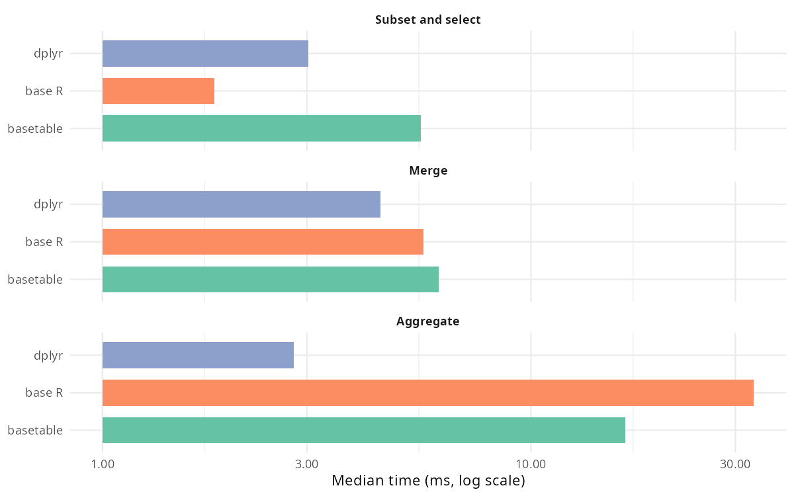
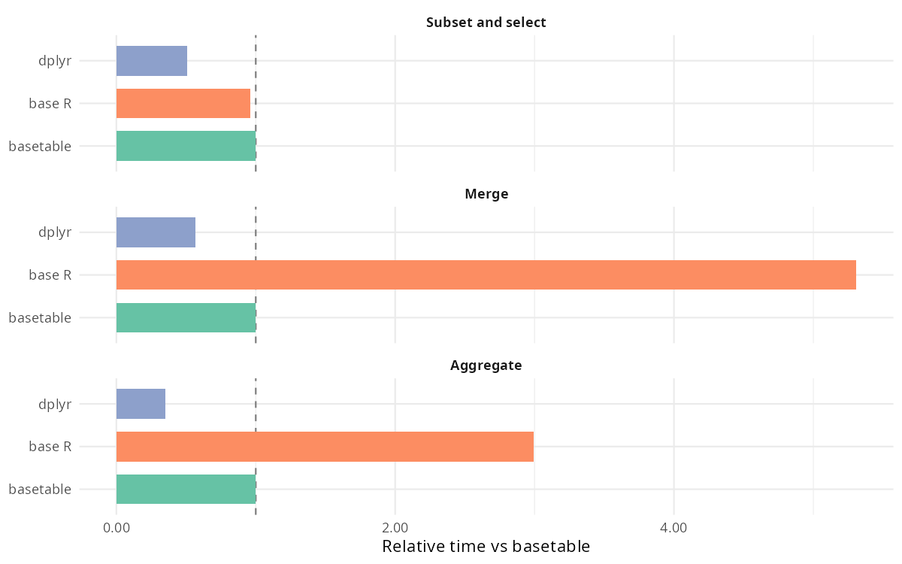

# basetable

`basetable` is a compact R package for tabular data manipulation and exploratory
data analysis with:

- base-style naming and semantics
- `data.table` as the execution backend
- explicit, standard-evaluation interfaces
- natural support for both nested calls and `|>`

This package is not a dplyr clone. The API centers on functions that feel close
to `subset()`, `transform()`, `aggregate()`, `merge()`, `split()`, and
`reshape()`.

## Status

This repository now contains the initial package scaffold, naming dictionary,
semantic specification, first implementation pass, tests, vignettes, and
benchmark scripts.

## Benchmarks

The `Benchmarks` vignette contains the reproducible report. The summary below
uses 15 iterations per workload on this workspace.





| Operation | Implementation | Median (ms) | Iterations / sec | Memory (MB) | Relative time |
| --- | --- | ---: | ---: | ---: | ---: |
| Subset and select | basetable | 2.36 | 406.5 | 4.57 | 1.00 |
| Subset and select | data.table | 1.98 | 470.9 | 3.27 | 0.84 |
| Subset and select | base R | 1.67 | 596.6 | 3.10 | 0.71 |
| Subset and select | dplyr | 2.56 | 370.8 | 4.98 | 1.08 |
| Merge | basetable | 5.45 | 176.1 | 3.76 | 1.00 |
| Merge | data.table | 5.57 | 178.5 | 3.35 | 1.02 |
| Merge | base R | 5.51 | 175.2 | 3.35 | 1.01 |
| Merge | dplyr | 4.65 | 204.2 | 5.81 | 0.85 |
| Aggregate | basetable | 1.83 | 519.2 | 0.91 | 1.00 |
| Aggregate | data.table | 2.16 | 406.5 | 3.12 | 1.18 |
| Aggregate | base R | 34.75 | 30.3 | 28.55 | 19.02 |
| Aggregate | dplyr | 2.61 | 369.7 | 7.01 | 1.43 |
| Group count | basetable | 1.22 | 799.4 | 2.77 | 1.00 |
| Group count | data.table | 0.88 | 1115.1 | 2.70 | 0.72 |
| Group count | base R | 2.11 | 459.2 | 5.73 | 1.73 |
| Group count | dplyr | 2.27 | 349.4 | 5.14 | 1.86 |

`basetable` wraps `data.table` as its execution backend, so the `data.table`
row is the one that matters most: it isolates wrapper overhead from the
backend's own performance. The `data.table` row above uses the idiomatic
expression a user would hand-write for each operation (e.g. `.(value =
mean(value))` for aggregation), which is not always exactly the code path
`basetable`'s wrapper generates internally — so a basetable row at or below
1.00x relative to data.table (as aggregate shows here) reflects a different
data.table idiom being used, not the wrapper beating its own backend at
identical work. A stricter benchmark that forces both sides through the same
internal j-expression and averages over 300 iterations puts basetable's
actual wrapper overhead at roughly 1.2x for subset, 1.1x for aggregate, and
about parity for merge (the large base R gap here is `stats::aggregate`'s
formula-interface overhead, not a basetable result).

A separate perf pass rewrote several other functions that previously did
their grouping/joining/row iteration in pure base R instead of using
data.table's compiled internals (tracked in `inst/benchmarks/benchmark-all.R`
against native data.table equivalents, not shown in the chart above). The
largest fix was `rollingmerge()`, which reimplemented a rolling/nearest join
with a hand-rolled per-group R loop and measured at roughly **1500x** the
cost of data.table's native `roll=` join before being rewritten to use it
directly — it now runs at parity. `count()` (shown above as "Group count"),
`duplicated_keys()`, `freq()`, `filldown()`, `fillup()`, `split()`, and
`summarise()`/`summarize()`/`summaries()` all saw similar (smaller)
reductions in overhead from the same kind of fix.

Rerun `vignettes/benchmarking.Rmd` to refresh the report if the workload or
implementation changes.

## Installation

```r
# development install
# install.packages("pak")
pak::pak("path/to/project-basetable")
```

## Minimal examples

Nested style:

```r
library(basetable)

describe(
  transform(
    subset(mtcars, cyl == 6, select = c("mpg", "hp", "wt", "cyl")),
    power = hp / wt
  )
)
```

Pipe style:

```r
library(basetable)

mtcars |>
  pick(c("mpg", "hp", "wt", "cyl")) |>
  transform(power = hp / wt) |>
  aggregate(by = "cyl", value = c("mpg", "power"), fun = mean)
```

Table 1 style summary:

```r
library(basetable)

summarytab(
  transform(mtcars, am = factor(am, labels = c("Automatic", "Manual"))),
  vars = c("mpg", "hp"),
  by = "am",
  p_value = TRUE
)
```

## Operation dictionary

| Family | Exported function | Base reference |
| --- | --- | --- |
| Row subsetting | `subset()` | `base::subset()` |
| Column keeping | `pick()` | `[` column selection |
| Column dropping | `drop()` | negative column indexing |
| Transformation | `transform()`, `within()` | base equivalents |
| Ordering | `reorder()` | `order()` |
| Aggregation | `aggregate()`, `count()` | `aggregate()`, `table()` |
| Joining | `merge()` | `merge()` |
| Split/apply/combine | `split()`, `by_apply()`, `combine()` | `split()`, `by()` |
| Reshaping | `reshape()`, `stack()`, `unstack()` | base equivalents |
| Inspection | `glimpse()`, `dims()`, `types()`, `headtail()` | `str()`, `dim()`, `head()` |
| EDA | `describe()`, `missingness()`, `profile()`, `freq()`, `summarytab()`, `compare()` | base summaries |

## Positioning

Compared with base R, `basetable` provides a tighter operation dictionary,
faster internals for common table tasks, and compact EDA helpers. Compared with
raw `data.table`, it favors a stable function interface over `[i, j, by]`.
Compared with dplyr, it avoids tidy evaluation, grouped-object state, and verb
grammar centered on `filter()`, `mutate()`, and `summarise()`.
