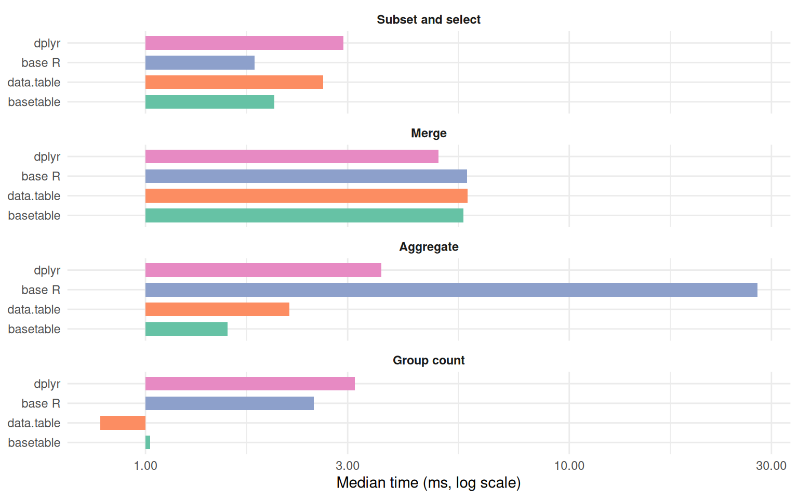
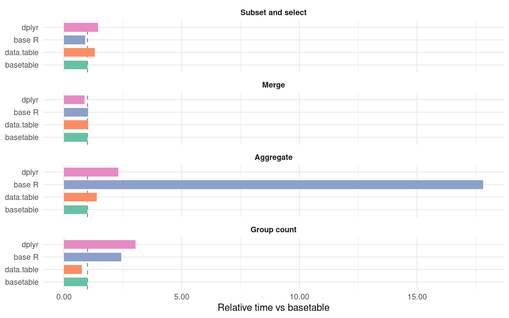

# basetable

<!-- badges: start -->
[](https://github.com/ielbadisy/basetable/actions/workflows/R-CMD-check.yaml)
[](https://opensource.org/licenses/MIT)
<!-- badges: end -->

`basetable` gives base-R users a `data.table` engine behind familiar syntax:
you write `subset()`, `transform()`, `aggregate()`, `merge()`, and `split()`,
and the package returns `data.table` objects without asking you to learn
`data.table`'s `[i, j, by]` syntax or dplyr's tidy evaluation.

This is a deliberately niche tool, not a dplyr/data.table competitor: it's
aimed at

- teaching table manipulation to people learning base R, without the added
  cognitive load of tidyverse's non-standard evaluation or data.table's terse
  syntax, and
- migrating a codebase that's built on base R's `subset()`/`merge()`/
  `aggregate()`/etc. to `data.table` objects with minimal rewriting, rather
  than a full rewrite onto dplyr or raw `data.table`.

Design goals:

- base-style naming and semantics
- `data.table` as the execution backend
- explicit, standard-evaluation interfaces
- natural support for both nested calls and `|>`

## Using basetable alongside dplyr and data.table

`basetable` deliberately reuses base-R verb names: `subset()`, `merge()`,
`filter()`, `count()`, `transform()`, `split()`, and others, because that's
the whole point (see above). The tradeoff: if you `library(dplyr)` or
`library(data.table)` in the same session, whichever package was attached
**last** wins for any shared name, silently shadowing the other. We hit this
ourselves during development: attaching `dplyr` in one script shadowed
`basetable::pick()` used later in the same session.

Two ways to avoid it:

- Call the function you mean explicitly: `basetable::filter(...)`,
  `dplyr::filter(...)`.
- If you already use the [`conflicted`](https://conflicted.r-lib.org/)
  package, declare a preference once per session:
  `conflicted::conflict_prefer("filter", "basetable")`.

## Status

Version 0.5.4 provides a tested in-memory manipulation, exploration, and
validation toolkit with a compact canonical core. Every public function has
direct test coverage, the package includes introductory, manipulation,
exploration, complete-reference, and benchmark vignettes, and the CI matrix
checks release R on Linux, macOS, and Windows plus oldrel and devel R.

### Highlights in 0.5.4

- Accent removal and general transliteration are deterministic across Linux,
  macOS, and Windows, and the complete PDF reference builds portably in CI.
- `transform()`, `mutate()`, and `transmute()` resolve ordinary values from
  their true calling function while retaining sequential-expression support.
- Mixed ascending/descending multi-column ordering is supported by
  `reorder()` and `orderrows()`.
- Core verbs stay on data.table paths and preserve their input, avoiding
  unnecessary data.frame round-trips and duplicate return copies.
- A scalable benchmark measures runtime and allocated memory at 100,000,
  1 million, and 10 million rows.
- The vignettes define a compact canonical workflow designed to remain
  predictable for people and program-generating tools such as language
  models. No additional public alias layer is required.

## Benchmarks

The `Benchmarks` vignette contains the reproducible report. The first summary
below uses 15 iterations per workload on this workspace.





| Operation | Implementation | Median (ms) | Iterations / sec | Memory (MB) | Relative time |
| --- | --- | ---: | ---: | ---: | ---: |
| Subset and select | basetable | 2.01 | 526.1 | 4.57 | 1.00 |
| Subset and select | data.table | 2.63 | 402.3 | 3.27 | 1.30 |
| Subset and select | base R | 1.81 | 543.8 | 3.10 | 0.90 |
| Subset and select | dplyr | 2.93 | 337.4 | 5.00 | 1.46 |
| Merge | basetable | 5.62 | 174.1 | 3.65 | 1.00 |
| Merge | data.table | 5.75 | 172.7 | 3.35 | 1.02 |
| Merge | base R | 5.74 | 174.1 | 3.35 | 1.02 |
| Merge | dplyr | 4.92 | 202.6 | 5.81 | 0.87 |
| Aggregate | basetable | 1.56 | 595.8 | 0.91 | 1.00 |
| Aggregate | data.table | 2.18 | 455.5 | 3.12 | 1.40 |
| Aggregate | base R | 27.82 | 35.9 | 28.47 | 17.81 |
| Aggregate | dplyr | 3.61 | 281.9 | 7.04 | 2.31 |
| Group count | basetable | 1.02 | 883.7 | 2.81 | 1.00 |
| Group count | data.table | 0.78 | 1226.1 | 2.70 | 0.76 |
| Group count | base R | 2.49 | 401.9 | 5.73 | 2.44 |
| Group count | dplyr | 3.12 | 324.3 | 5.14 | 3.04 |

The separate scale harness gives basetable and raw data.table the same
input-immutability contract and measures allocated memory as well as time.
At 10 million rows on the reference Linux system:

| Operation | Time vs data.table | Memory vs data.table |
| --- | ---: | ---: |
| `filter()` | 0.97 | 1.00 |
| `transform()` | 1.24 | 1.25 |
| `count()` | 1.01 | 1.00 |
| `orderrows()` | 1.09 | 1.00 |

Timings are machine-specific; the benchmark vignette records the environment,
absolute results, iteration counts, and interpretation. Run
`inst/benchmarks/benchmark-scale.R` to reproduce all three size tiers.

`basetable` wraps `data.table` as its execution backend, so the `data.table`
row is the one that matters most: it isolates wrapper overhead from the
backend's own performance. The `data.table` row above uses the idiomatic
expression a user would hand-write for each operation (e.g. `.(value =
mean(value))` for aggregation), which is not always exactly the code path
`basetable`'s wrapper generates internally, so a basetable row at or below
1.00x relative to data.table (as aggregate shows here) reflects a different
data.table idiom being used, not the wrapper beating its own backend at
identical work. A stricter benchmark that forces both sides through the same
internal j-expression and averages over 300 iterations puts basetable's
actual wrapper overhead at roughly 1.2x for subset, 1.1x for aggregate, and
about parity for merge (the large base R gap here is `stats::aggregate`'s
formula-interface overhead, not a basetable result).

A separate perf pass rewrote several other functions that previously did
their grouping/joining/row iteration in pure base R instead of using
data.table's compiled internals (tracked in `inst/benchmarks/benchmark-all.R`
against native data.table equivalents, not shown in the chart above). The
largest fix was `rollingmerge()`, which reimplemented a rolling/nearest join
with a hand-rolled per-group R loop and measured at roughly **1500x** the
cost of data.table's native `roll=` join before being rewritten to use it
directly, and it now runs at parity. `count()` (shown above as "Group count"),
`duplicated_keys()`, `freq()`, `filldown()`, `fillup()`, `split()`, and
`summarise()`/`summarize()`/`summaries()` all saw similar (smaller)
reductions in overhead from the same kind of fix.

Rerun `vignettes/benchmarking.Rmd` and the scale harness to refresh the report
if the workload or implementation changes.

## Installation

```r
# development install
# install.packages("pak")
pak::pak("path/to/project-basetable")
```

## Minimal examples

Nested style:

```r
library(basetable)

describe(
  transform(
    subset(mtcars, cyl == 6, select = c("mpg", "hp", "wt", "cyl")),
    power = hp / wt
  )
)
```

Pipe style:

```r
library(basetable)

mtcars |>
  pick(c("mpg", "hp", "wt", "cyl")) |>
  transform(power = hp / wt) |>
  aggregate(by = "cyl", value = c("mpg", "power"), fun = mean)
```

Table 1 style summary:

```r
library(basetable)

summarytab(
  transform(mtcars, am = factor(am, labels = c("Automatic", "Manual"))),
  vars = c("mpg", "hp"),
  by = "am",
  p_value = TRUE
)
```

## Operation dictionary

| Family | Exported function | Base reference |
| --- | --- | --- |
| Row subsetting | `subset()` | `base::subset()` |
| Column keeping | `pick()` | `[` column selection |
| Column dropping | `drop()` | negative column indexing |
| Transformation | `transform()`, `within()` | base equivalents |
| Ordering | `reorder()` | `order()` |
| Aggregation | `aggregate()`, `count()` | `aggregate()`, `table()` |
| Joining | `merge()` | `merge()` |
| Split/apply | `split()`, `applyby()` | `split()` |
| Reshaping | `reshape()`, `stack()`, `unstack()` | base equivalents |
| Inspection | `glimpse()`, `dims()`, `types()`, `headtail()` | `str()`, `dim()`, `head()` |
| EDA | `describe()`, `missingness()`, `profile()`, `freq()`, `summarytab()`, `compare()` | base summaries |

## Positioning

Compared with base R, `basetable` provides a tighter operation dictionary,
faster internals for common table tasks, and compact EDA helpers. Compared with
raw `data.table`, it favors a stable function interface over `[i, j, by]`.
Compared with dplyr, it avoids tidy evaluation, grouped-object state, and verb
grammar centered on `filter()`, `mutate()`, and `summarise()`.

`basetable` is not trying to out-compete dplyr or data.table for new
projects that are free to pick any tool; both are more established
choices with a much larger ecosystem. It's aimed specifically at people
teaching or learning base R, and at codebases already built on base-R table
semantics that want `data.table`'s speed without a rewrite.
