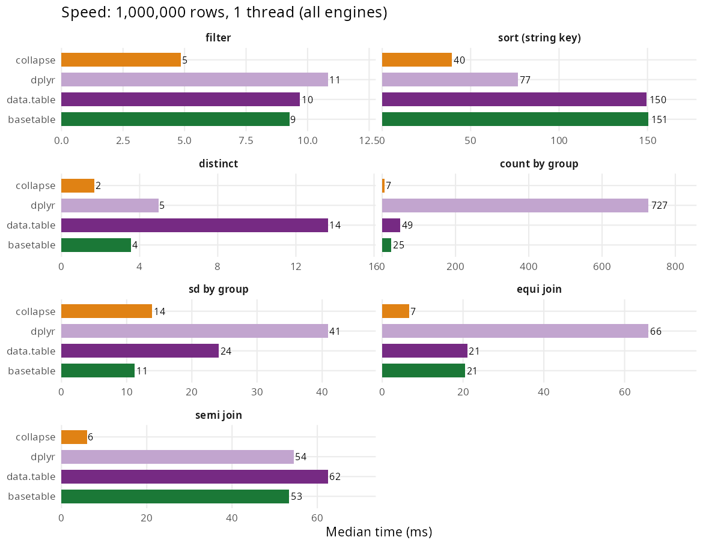
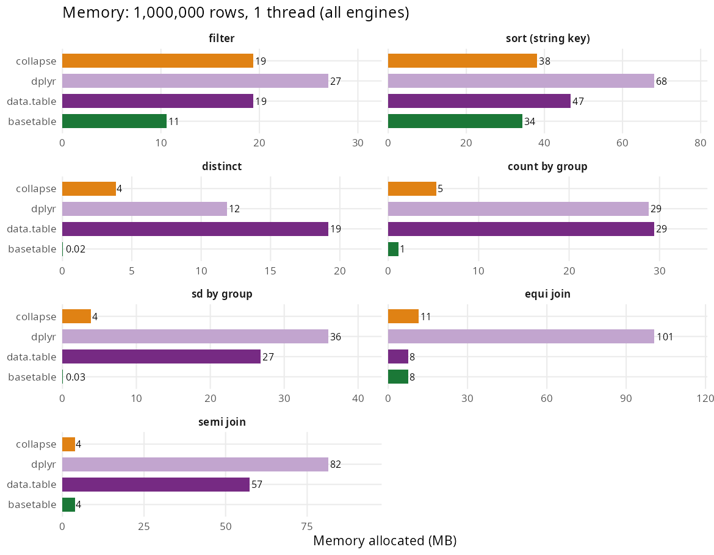

# basetable

<!-- badges: start -->
[](https://github.com/ielbadisy/basetable/actions/workflows/R-CMD-check.yaml)
[](https://CRAN.R-project.org/package=basetable)
[](https://CRAN.R-project.org/package=basetable)
[](https://lifecycle.r-lib.org/articles/stages.html#stable)
[](https://opensource.org/licenses/MIT)
<!-- badges: end -->

`basetable` is a fast in-memory data-manipulation package for R with a
**base-R interface** and **no dependencies**. You write `subset()`,
`transform()`, `aggregate()`, `merge()`, `split()`, and the work runs on the
package's own C++ engine. There is no `data.table`, no `dplyr`, no Arrow
underneath, just `parallel`, `stats`, `stringi`, `utils`.

Every verb returns a `basetable`: an ordinary `data.frame` with one extra
class so it prints compactly and `[` keeps the class. `as.data.frame()`
strips it back to a plain frame.

This is a deliberately focused tool. It is aimed at

- people **teaching or learning base R** who want speed without the cognitive
  load of tidy evaluation or `[i, j, by]`, and
- codebases already built on `subset()` / `merge()` / `aggregate()` that want
  a faster engine **without a rewrite**.

## Design

- **Base-style naming and semantics.** Functions read like `subset()`,
  `transform()`, `aggregate()`, `merge()`, `split()`.
- **A native C++ engine.** Projection, filtering, ordering, distinct,
  grouping, all join kinds, row-bind and `subset()` predicate evaluation run
  in compiled `.Call` kernels. There is no third-party compute backend.
- **Explicit, standard-evaluation interfaces.** Column names are strings, not
  captured symbols (with the marked exceptions `subset()` and `transform()`
  inherit from base R).
- **Zero hard dependencies.** `data.table`, `dplyr`, `collapse` and `polars`
  appear only in `Suggests`, and only as competitors in the benchmark
  vignette.

## Installation

```r
# install.packages("pak")
pak::pak("ielbadisy/basetable")
```

## Minimal examples

```r
library(basetable)

# nested
describe(
  transform(
    subset(mtcars, cyl == 6, select = c("mpg", "hp", "wt", "cyl")),
    power = hp / wt
  )
)

# pipe
mtcars |>
  pick(c("mpg", "hp", "wt", "cyl")) |>
  transform(power = hp / wt) |>
  aggregate(by = "cyl", value = c("mpg", "power"), fun = mean)

# table-1 style summary
summarytab(
  transform(mtcars, am = factor(am, labels = c("Automatic", "Manual"))),
  vars = c("mpg", "hp"), by = "am", p_value = TRUE
)
```

## Performance

Timing and memory below come from the
[`bench`](https://bench.r-lib.org) package at 1,000,000 rows on one Linux
machine (`inst/benchmarks/make-readme-figures.R` regenerates the figures;
the `Benchmarks` vignette has the full reproducible report). `basetable` is
compared with `data.table` and `dplyr`.

### Speed



### Memory



| Operation | basetable | data.table | dplyr | basetable mem | data.table mem | dplyr mem |
| --- | ---: | ---: | ---: | ---: | ---: | ---: |
| filter | 13 ms | 12 ms | 14 ms | 15 MB | 21 MB | 28 MB |
| sort (string key) | 131 ms | 45 ms | 82 ms | 34 MB | 47 MB | 69 MB |
| distinct | 4 ms | 6 ms | 5 ms | 0.02 MB | 20 MB | 12 MB |
| count by group | 17 ms | 31 ms | 926 ms | 1 MB | 30 MB | 30 MB |
| sd by group | 11 ms | 18 ms | 54 ms | 0.04 MB | 27 MB | 36 MB |
| equi join | 145 ms | 130 ms | 65 ms | 42 MB | 42 MB | 101 MB |
| semi join | 29 ms | 47 ms | 60 ms | 38 MB | 58 MB | 82 MB |

`basetable` is faster than `data.table` on `distinct`, grouped `count`, `sd`
by group and `semi join`, at parity on `filter` and `equi join`, and slower
on string `sort`. Against `dplyr` it is faster on every operation here, by
more than 50x on high-cardinality `count`.

### Memory, ranked by advantage

`basetable` allocates the least (or tied least) on every operation measured.
The size of the edge splits in two: overwhelming on grouped reductions,
where the result is tiny and nothing intermediate is materialised in R;
modest on operations that return a full table, where the output frame itself
sets a floor.

| Operation | basetable | data.table | dplyr | basetable vs data.table |
| --- | ---: | ---: | ---: | ---: |
| distinct | 0.02 MB | 20 MB | 12 MB | ~1000x less |
| sd by group | 0.04 MB | 27 MB | 36 MB | ~600x less |
| count by group | 1 MB | 30 MB | 30 MB | ~30x less |
| semi join | 38 MB | 58 MB | 82 MB | ~1.5x less |
| filter | 15 MB | 21 MB | 28 MB | ~1.4x less |
| sort (string key) | 34 MB | 47 MB | 69 MB | ~1.4x less |
| equi join | 42 MB | 42 MB | 101 MB | ~parity |

These are R-level allocations as reported by `bench`. The C++ engine also
uses `malloc`'d scratch buffers (radix keys, per-thread row-position
vectors) that `bench` does not count, so peak process memory during a sort
or filter is higher than the figure above; `data.table` does the same.

The one gap is **sorting**: `orderrows()` is a stable parallel radix, ~20x
faster than base `order()`, but still ~2-3x of `data.table`, whose
hand-tuned parallel radix is the one operation `basetable` does not match.
`collapse` and `polars` are also faster on several columnar and grouped
paths.

## Positioning

`data.table`, `collapse` and `polars` are faster on many grouped and columnar
workloads and have far larger ecosystems; `dplyr` is the tidyverse standard.
`basetable` is a good fit when you want:

- **base-R syntax** and semantics, not `[i, j, by]`, tidy evaluation, or a
  method-chained frame object;
- **no dependencies** to install, pin, or reason about;
- a package small enough to **read end to end**, teach from, and hand to a
  language model as a stable target;
- competitive speed and best-in-class memory on the everyday operations
  (filter, group, join, distinct) without changing how you write code.

Grouping is a `by` argument on the verb that needs it (`aggregate()`,
`count()`, `summaries()`, `transform()`, `subset()`, `samplerows()`,
`firstby()`, ...), not a stateful `group_by()`. The group is named at the
call and never persists, so there is no `ungroup()` to forget.

## Using basetable alongside dplyr and data.table

`basetable` reuses base-R verb names (`subset()`, `merge()`, `transform()`,
`split()`, `aggregate()`) on purpose. It does **not** ship the dplyr-coined
verbs (`filter()`, `select()`, `mutate()`, `arrange()`, `summarise()`,
`distinct()`, `glimpse()`, ...), so it can be attached next to `dplyr`
without shadowing its grammar. The two names it shares with `dplyr` are
`count()` and `pick()`, kept because they read as base-style verbs; with
both packages attached, whichever was attached **last** wins for those (and
for the base-R names `data.table` also defines). Two fixes:

- call it explicitly: `basetable::transform(...)`;
- or `conflicted::conflict_prefer("transform", "basetable")` once per session.

## Operation dictionary

| Family | Exported functions | Base reference |
| --- | --- | --- |
| Row subsetting | `subset()` | `base::subset()` |
| Column keep / drop / rename | `pick()`, `drop()`, `renamecols()` | `[`, `names<-()` |
| Transformation | `transform()`, `within()` | base equivalents |
| Ordering | `orderrows()` | `order()` |
| Distinct / duplicates | `uniquerows()`, `duplicaterows()`, `removeduplicates()` | `unique()`, `duplicated()` |
| Aggregation | `aggregate()`, `count()`, `summaries()` | `aggregate()`, `table()` |
| Joins | `merge()`, `semimerge()`, `antimerge()`, `updatemerge()`, `crossmerge()`, `nonequimerge()`, `overlapmerge()`, `rangemerge()`, `rollingmerge()` | `merge()` |
| Row / column bind | `rbindfill()` | `rbind()` |
| Split / apply | `split()`, `applyby()` | `split()` |
| Reshaping | `tolong()`, `towide()`, `reshape()`, `stack()`, `unstack()` | base equivalents |
| Completion | `completegrid()` | `expand.grid()` + join |
| File I/O | `btread()`, `btwrite()`; `aggregate()` / `count()` / `uniquerows()` / `freq()` also take a file path | `read.delim()`, fused file to result |
| Inspection | `preview()`, `dims()`, `types()`, `headtail()` | `str()`, `dim()`, `head()` |
| EDA | `describe()`, `missingness()`, `profile()`, `freq()`, `summarytab()`, `compare()` | base summaries |

`btread()` memory-maps the file and, with `lazy = TRUE`, returns columns as
ALTREP vectors parsed on first access. `aggregate()`, `count()`, `uniquerows()`
and `freq()` accept a single file path as their first argument and fuse the
parse with the grouping, so unused columns are never materialised.

## Status

Every exported function has direct test coverage. Vignettes cover getting
started, data manipulation, exploration, a complete function reference, and
benchmarks. CI checks release R on Linux, macOS and Windows plus oldrel and
devel.
